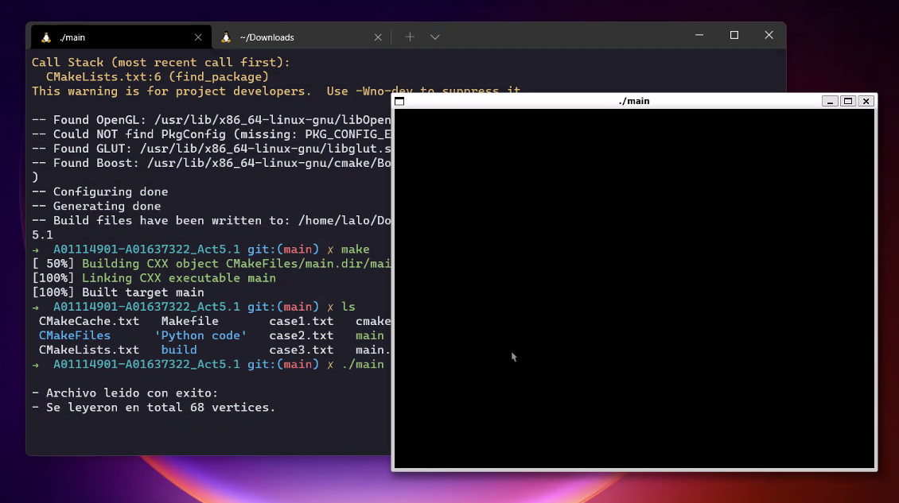
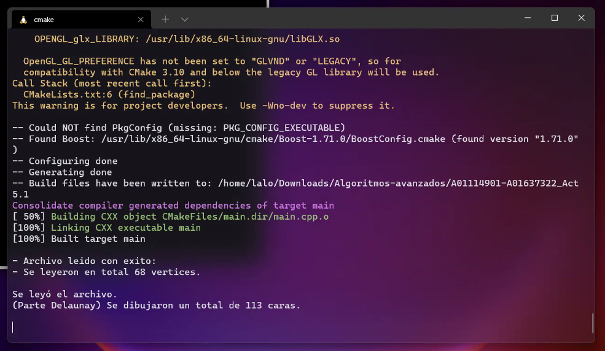

# Triangulación de Delaunay

## Luis Armando Salazar Lopez A01114901

## Carlos Moises Chavez Jimenez A01637322

### Comentarios del programa

En el codigo de Python solamente fue cuestión de instalar las librerías correspondientes, y el programa se ejecuto sin
ningún problema. Se recibio de entrada una fotografia, y se devuelve un archivo de texto con las coordenadas de los puntos
que deben ser dibujados. Ahora bien, hablado del código de C++. El programa recibe un archivo con extencion .txt de entrada,
y debe mostrar las caras dibujadas. En este caso, no se muestran gráficamente los resultados, pero sí se imprime la cantidad
de puntos que se rescato del archivo de texto. Y también se muestra la cantidad de caras que deberian haberse dibujado.

### Primer Caso de Prueba

504 160
505 186
506 211
509 236
515 260
529 281
548 298
571 310
598 314
624 312
645 300
661 285
672 264
678 242
682 220
686 197
689 174
526 144
538 129
557 125
576 128
594 136
620 137
637 133
655 134
671 141
678 158
608 153
608 168
609 183
609 199
583 211
594 214
605 218
615 216
625 215
545 157
556 151
568 151
578 159
567 160
555 160
629 164
642 159
653 160
662 169
652 169
641 168
560 244
574 234
590 231
602 235
615 234
629 240
640 252
627 263
613 267
599 266
586 263
571 255
565 244
589 238
602 240
615 241
635 251
614 255
600 255
587 252

#### Explicación: Utilizamos este caso de prueba por ser el de ejemplo en el codigo de python

### Segundo caso de Prueba

376 229
376 254
379 280
384 306
394 330
411 352
431 369
453 383
481 384
511 379
541 365
568 348
589 324
598 296
600 263
600 232
598 200
377 187
385 171
402 165
421 165
440 171
475 170
498 163
521 159
543 161
563 172
459 189
459 207
458 225
457 245
446 263
455 265
466 267
477 262
488 258
399 206
408 194
422 192
435 199
422 202
410 204
501 195
513 186
527 186
539 194
527 196
514 197
432 305
446 297
460 290
472 290
484 286
505 287
526 292
508 302
490 308
477 311
465 312
450 314
438 305
462 299
474 298
486 295
519 294
487 297
474 300
463 301

#### Explicación: Imagen de otro jugador en diferente posicion y diferente fondo

### Tercer caso de Prueba

1244 323
1241 366
1244 410
1252 453
1265 495
1286 533
1315 566
1348 590
1383 598
1417 594
1449 570
1476 540
1497 506
1513 469
1523 431
1528 392
1529 353
1279 324
1301 306
1332 304
1362 311
1391 320
1418 322
1444 319
1471 319
1497 328
1509 350
1402 344
1401 371
1400 398
1399 426
1363 436
1378 445
1395 451
1411 447
1427 441
1312 336
1329 329
1346 331
1362 345
1344 345
1326 344
1428 354
1444 342
1462 344
1477 353
1462 358
1444 357
1344 492
1360 480
1379 476
1393 481
1409 478
1423 485
1433 499
1420 513
1406 520
1389 520
1374 517
1357 508
1353 491
1377 489
1392 491
1407 490
1424 496
1407 500
1391 502
1377 499

#### Explicación: Imagen de otro jugador en diferente posicion y fondo

### Resultados

- Programa corriendo

- Resultados del programa

